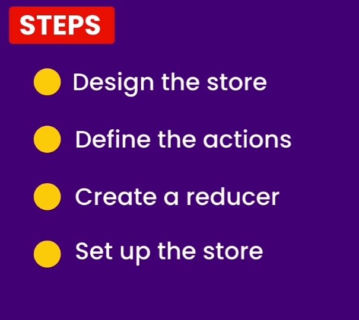

## Redux

----
**Important terms **

- Store
    - holds the global state of an app
    - 
- Reducer
    - How the store gets updated
    - this is a function
    - takes current instance of the store and updates store.
    - think of it as event handlers.
    - 
- Action
    - plain javascript object explained what just happened
    - THis could be simple as just an event
    - also can be called events
    - pure functions.
    - 
      - type: is a must usually a string 
      - description: ususally data
      - example of actions with payLoad 
      
      - note that payload will hold the data here. 
  ### How Redux Works

----

## Steps in creating redux store

